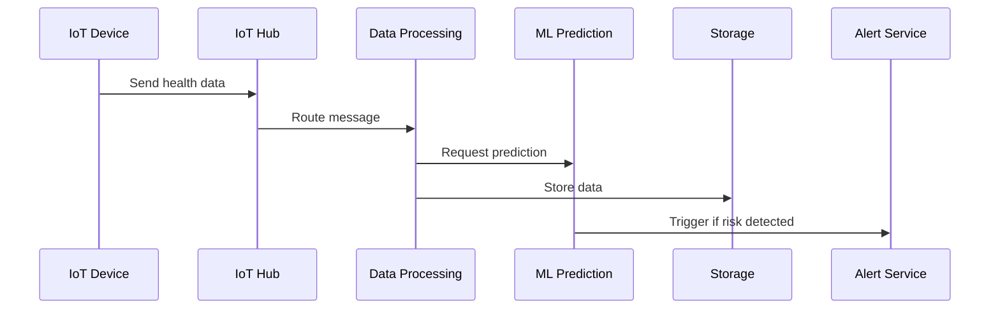
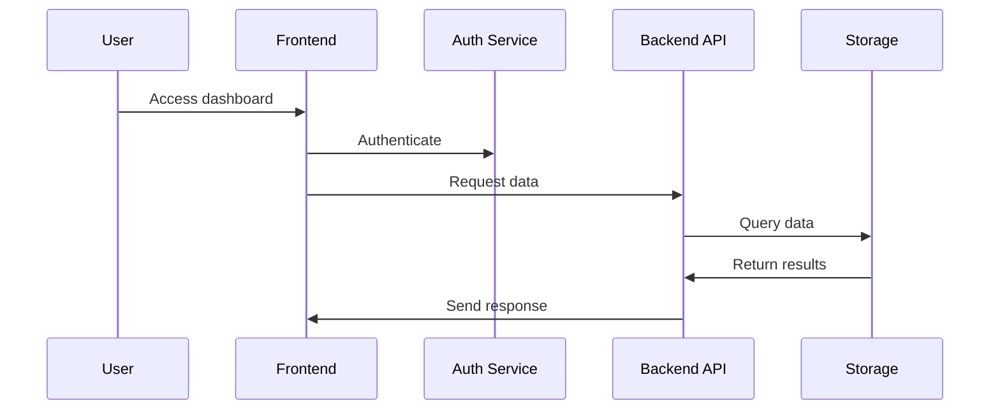
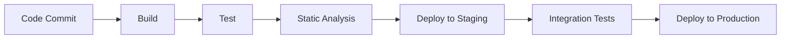

# AIMED System Architecture

## Overview
AIMED is a distributed system built on Azure cloud services, designed to provide real-time health monitoring and predictive analytics. The architecture follows microservices principles and ensures scalability, reliability, and security.

## System Components

### 1. Data Collection Layer
#### IoT Hub Service
- **Purpose**: Manages device connectivity and data ingestion
- **Components**:
  - Azure IoT Hub
  - Device SDK
  - Message routing
- **Key Features**:
  - Secure device authentication
  - Bi-directional communication
  - Message routing to various services
  - Device management

### 2. Processing Layer
#### Data Processing Service
- **Technology**: Azure Functions
- **Components**:
  - Data validation
  - Data transformation
  - Storage management
- **Functions**:
  - `ProcessHealthData`: Validates and processes incoming health data
  - `AggregateMetrics`: Computes statistical aggregations
  - `StoreHealthData`: Manages data persistence

#### ML Prediction Service
- **Technology**: Azure Machine Learning
- **Components**:
  - Model training pipeline
  - Real-time inference
  - Model monitoring
- **Features**:
  - Automated retraining
  - Model versioning
  - Performance monitoring

### 3. Storage Layer
#### Data Storage
- **Primary Storage**: Azure SQL Database
  - Health metrics
  - User profiles
  - Alert history
- **Blob Storage**: Azure Blob Storage
  - Raw device data
  - ML model artifacts
  - System logs

### 4. Application Layer
#### Backend API
- **Technology**: Azure Functions
- **Components**:
  - RESTful API endpoints
  - Authentication middleware
  - Rate limiting
- **Key Features**:
  - JWT authentication
  - Request validation
  - Error handling

#### Frontend Application
- **Technology**: React.js
- **Components**:
  - Dashboard
  - Alerts view
  - Settings management
- **Features**:
  - Real-time updates
  - Responsive design
  - Data visualization

### 5. Security Layer
#### Authentication Service
- **Technology**: Azure Active Directory
- **Features**:
  - User authentication
  - Role-based access control
  - Token management

#### Key Management
- **Technology**: Azure Key Vault
- **Stored Items**:
  - API keys
  - Certificates
  - Connection strings

## Data Flow

### 1. Health Data Collection

### 2. User Interaction

## Scalability Considerations

### Horizontal Scaling
- Azure Functions: Auto-scaling based on load
- IoT Hub: Multiple units for increased throughput
- Database: Elastic pools for dynamic scaling

### Performance Optimization
- Caching strategy
  - Redis Cache for frequent queries
  - CDN for static content
- Message queuing
  - Event Hub for high-throughput scenarios
  - Service Bus for complex workflows

## Security Measures

### Data Security
1. **In Transit**
   - TLS 1.3 encryption
   - Secure device communication
   - VPN for internal services

2. **At Rest**
   - Database encryption
   - Blob storage encryption
   - Key rotation policy

### Access Control
1. **Authentication**
   - Multi-factor authentication
   - Token-based API access
   - Device certificates

2. **Authorization**
   - Role-based access control
   - Resource-level permissions
   - Least privilege principle

## Monitoring and Logging

### Application Monitoring
- **Azure Application Insights**
  - Performance metrics
  - Error tracking
  - User behavior analytics

### System Health
- **Azure Monitor**
  - Resource utilization
  - Service health
  - Alert management

### Logging Strategy
- **Structured Logging**
  - Transaction correlation
  - Error context
  - Performance metrics

## Disaster Recovery

### Backup Strategy
1. **Database Backups**
   - Full backup: Daily
   - Differential backup: Every 6 hours
   - Transaction logs: Every 15 minutes

2. **Configuration Backups**
   - Infrastructure as Code
   - Configuration management
   - Secret rotation

### Recovery Procedures
1. **Service Recovery**
   - Automated failover
   - Region redundancy
   - Data consistency checks

2. **Data Recovery**
   - Point-in-time restoration
   - Cross-region replication
   - Data validation

## Development Workflow

### CI/CD Pipeline

### Environment Strategy
1. **Development**
   - Local development setup
   - Mocked services
   - Development databases

2. **Staging**
   - Production-like environment
   - Integration testing
   - Performance testing

3. **Production**
   - Blue-green deployment
   - Canary releases
   - Monitoring and alerts

## Future Considerations

### Scalability
- Multi-region deployment
- Edge computing integration
- Enhanced caching strategy

### Features
- Advanced analytics dashboard
- Mobile application
- AI-powered recommendations

### Integration
- Additional health devices
- Third-party health systems
- Health data standards compliance
