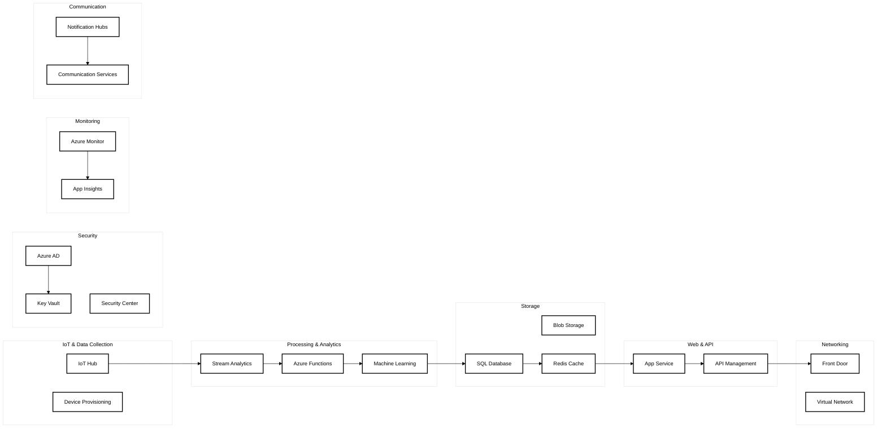

# Azure Services for AIMED System

## 1. IoT & Data Collection
- **Azure IoT Hub**
  - Purpose: Manage IoT device connectivity
  - Features:
    - Device-to-cloud telemetry
    - Device management
    - Secure communication
    - Message routing

- **Azure IoT Device Provisioning Service**
  - Purpose: Automated device registration
  - Features:
    - Zero-touch provisioning
    - Load balancing
    - Secure enrollment

## 2. Data Processing & Analytics
- **Azure Functions**
  - Purpose: Serverless compute for data processing
  - Use cases:
    - Data validation
    - Transformation
    - API endpoints
    - Event processing

- **Azure Stream Analytics**
  - Purpose: Real-time data processing
  - Features:
    - Complex event processing
    - Time-series analytics
    - Real-time dashboards

- **Azure Machine Learning**
  - Purpose: ML model development and deployment
  - Components:
    - Model training
    - Model deployment
    - Model monitoring
    - AutoML capabilities

## 3. Storage Solutions
- **Azure SQL Database**
  - Purpose: Structured data storage
  - Stores:
    - User profiles
    - Health metrics
    - Alert history
    - System configurations

- **Azure Blob Storage**
  - Purpose: Unstructured data storage
  - Stores:
    - Raw device data
    - ML models
    - System logs
    - Backup data

- **Azure Cache for Redis**
  - Purpose: High-performance caching
  - Use cases:
    - Session management
    - Real-time data caching
    - API response caching

## 4. Security & Identity
- **Azure Active Directory (Azure AD)**
  - Purpose: Identity management
  - Features:
    - User authentication
    - Single sign-on
    - Multi-factor authentication
    - Role-based access control

- **Azure Key Vault**
  - Purpose: Secure secret management
  - Stores:
    - API keys
    - Certificates
    - Connection strings
    - Encryption keys

- **Azure Security Center**
  - Purpose: Security monitoring
  - Features:
    - Threat protection
    - Security assessments
    - Regulatory compliance

## 5. Monitoring & Management
- **Azure Monitor**
  - Purpose: System monitoring
  - Components:
    - Application Insights
    - Log Analytics
    - Metrics
    - Alerts

- **Azure Application Insights**
  - Purpose: Application performance monitoring
  - Features:
    - User behavior analytics
    - Performance monitoring
    - Exception tracking
    - Availability monitoring

## 6. Communication Services
- **Azure Notification Hubs**
  - Purpose: Push notification service
  - Features:
    - Cross-platform notifications
    - Scheduled notifications
    - Segmentation

- **Azure Communication Services**
  - Purpose: Communication platform
  - Features:
    - SMS
    - Email
    - Voice calls
    - Chat

## 7. Web & API Hosting
- **Azure App Service**
  - Purpose: Web application hosting
  - Features:
    - Web apps
    - API apps
    - Auto-scaling
    - Deployment slots

- **Azure API Management**
  - Purpose: API gateway
  - Features:
    - API documentation
    - Rate limiting
    - Authentication
    - Analytics

## 8. Networking
- **Azure Front Door**
  - Purpose: Global load balancer
  - Features:
    - CDN integration
    - WAF capabilities
    - SSL/TLS termination

- **Azure Virtual Network**
  - Purpose: Network isolation
  - Features:
    - Network security groups
    - Service endpoints
    - Private endpoints

## Cost Optimization Services
- **Azure Cost Management**
  - Purpose: Cost monitoring and optimization
  - Features:
    - Budget alerts
    - Cost analysis
    - Resource optimization
    - Usage reporting

## Development Tools
- **Azure DevOps**
  - Purpose: Development lifecycle management
  - Features:
    - Source control
    - CI/CD pipelines
    - Project management
    - Test management

