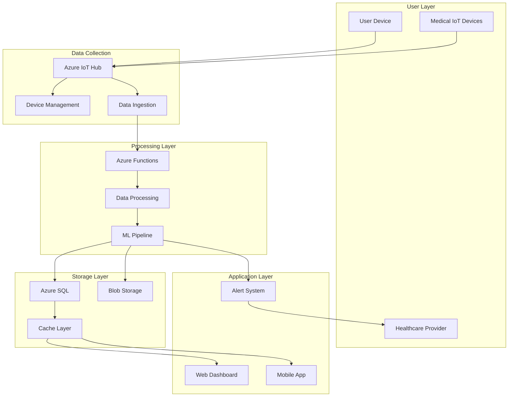
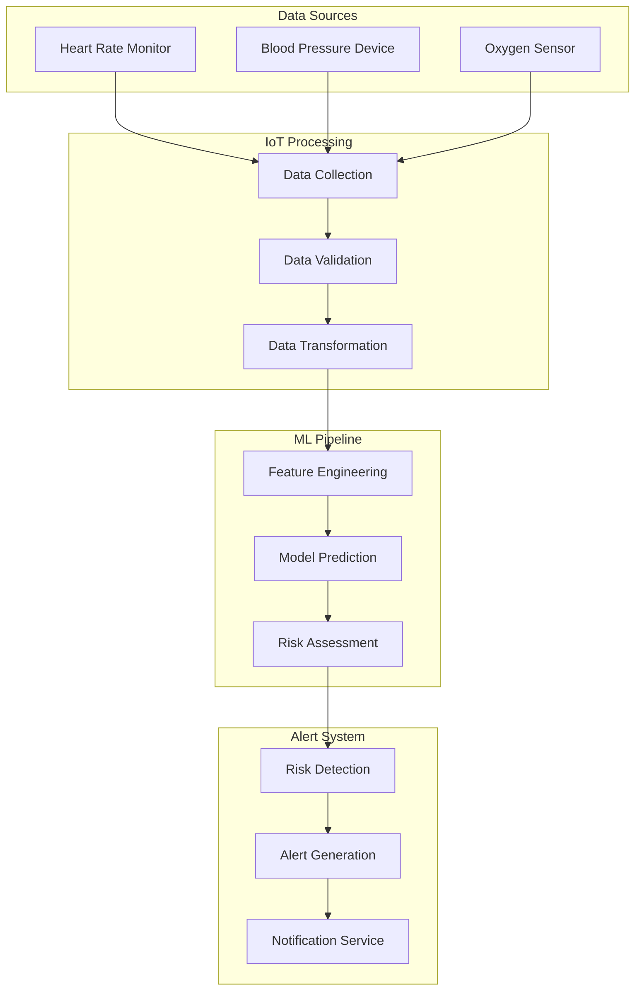
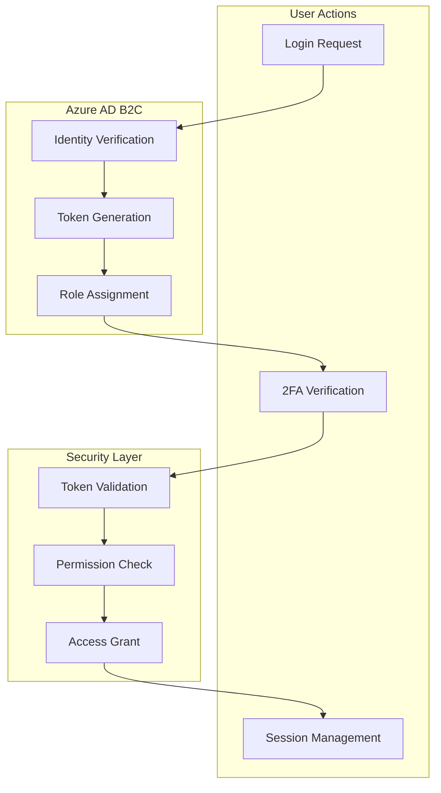
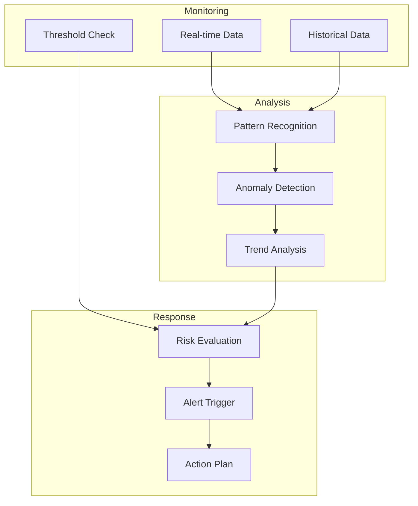
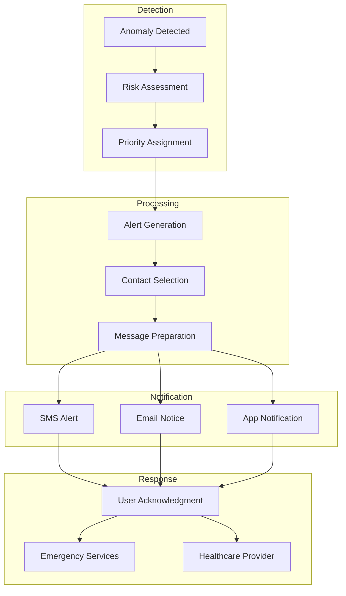

# AIMED System Flowcharts

## Required Images List
1. `aimed-logo.png` - Main project logo
2. `azure-services-icons.png` - Collection of Azure service icons
3. `medical-icons.png` - Health monitoring icons
4. `device-icons.png` - IoT device icons
5. `alert-icons.png` - Alert system icons
6. `user-interface-icons.png` - Dashboard UI icons

## 1. Overall System Architecture


## 2. Data Flow Pipeline


## 3. User Authentication Flow


## 4. Health Monitoring Pipeline


## 5. Alert System Flow


## Required Shell Script for Image Download
```bash
#!/bin/bash

# Create images directory
mkdir -p images

# Download required images
# Note: Replace URLs with actual image sources

# Project Logo
curl -o images/aimed-logo.png "URL_TO_LOGO"

# Azure Service Icons
curl -o images/azure-services-icons.png "URL_TO_AZURE_ICONS"

# Medical Icons
curl -o images/medical-icons.png "URL_TO_MEDICAL_ICONS"

# Device Icons
curl -o images/device-icons.png "URL_TO_DEVICE_ICONS"

# Alert Icons
curl -o images/alert-icons.png "URL_TO_ALERT_ICONS"

# UI Icons
curl -o images/user-interface-icons.png "URL_TO_UI_ICONS"

# Set permissions
chmod 644 images/*

echo "Image download complete!"
```

## Image Requirements:

1. **Project Logo (aimed-logo.png)**
   - Size: 500x500px
   - Format: PNG with transparency
   - Style: Modern, medical/tech themed

2. **Azure Service Icons (azure-services-icons.png)**
   - Size: 800x600px
   - Format: PNG with transparency
   - Including: IoT Hub, Functions, ML, SQL Database icons

3. **Medical Icons (medical-icons.png)**
   - Size: 600x600px
   - Format: PNG with transparency
   - Including: Heart rate, blood pressure, oxygen level icons

4. **Device Icons (device-icons.png)**
   - Size: 600x400px
   - Format: PNG with transparency
   - Including: Wearable devices, sensors, mobile devices

5. **Alert Icons (alert-icons.png)**
   - Size: 400x400px
   - Format: PNG with transparency
   - Including: Warning, emergency, notification icons

6. **UI Icons (user-interface-icons.png)**
   - Size: 800x600px
   - Format: PNG with transparency
   - Including: Dashboard elements, buttons, charts

Please review the image requirements and provide approval for downloading these resources. Once approved, I can help create the shell script with the actual image URLs.
