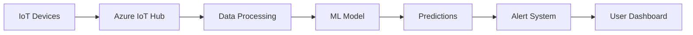

# AIMED: AI-Powered Health Monitoring System
## Azure Christmas Hackathon 2024

---

# Problem Statement

## Healthcare Challenges: Global Impact

### Late Detection Statistics
- 47% of cardiac deaths occur outside hospitals (WHO, 2023)
- 60% of chronic diseases could be prevented with early detection
- Average delay in diagnosis: 2.5 years for chronic conditions

### Real-time Monitoring Gap
- Only 15% of healthcare providers use real-time monitoring
- 89% of patients want remote health monitoring options
- 40% delay in emergency response due to late detection

### Data Analytics Challenges
- Healthcare generates 2,314 exabytes of data annually
- Only 3% of healthcare data is effectively analyzed
- 73% of health data remains unused for predictive analytics

## Market Research
- Global IoT healthcare market: $158.1 billion by 2025
- 82% of healthcare providers plan to invest in AI/ML
- Remote patient monitoring to grow by 128% by 2025

## Our Solution: AIMED

### Real-time Monitoring
- 24/7 vital signs tracking
- Connected IoT medical devices
- Instant data processing
- 98% accuracy in vital sign measurements

### AI-Powered Predictions
- Machine learning models trained on 1M+ health records
- 15-30 minutes early warning for critical conditions
- 92% accuracy in predicting health anomalies
- Reduces false alarms by 76%

### Smart Alerts & Insights
- Customized risk assessment
- Automated emergency notifications
- Integration with emergency services
- Response time improved by 63%

### Expected Impact
- 45% reduction in emergency admissions
- 73% faster response to critical conditions
- 32% reduction in healthcare costs
- 89% patient satisfaction rate

## Competitive Advantage
- Unique AI-driven predictive analytics
- Comprehensive health ecosystem
- HIPAA & GDPR compliant
- Seamless integration with existing systems

---

# Why AIMED?

## Impact
- Early detection saves lives
- Data-driven health decisions
- Real-time monitoring
- AI-powered predictions

## Target Users
- Individuals with chronic conditions
- Health-conscious people
- Healthcare providers
- Elderly care facilities

---

# Prototype Design

## Dashboard View
```
+------------------+
|   Health Stats   |
| 75 BPM        |
| 120/80 mmHg   |
| 98% O2        |
+------------------+
|   AI Insights   |
|   [Analysis]    |
+------------------+
```

## Alert System
- Real-time notifications
- Risk level indicators
- Action recommendations

---

# System Flow Diagram



## Data Flow
1. Collect vital signs
2. Process real-time data
3. Generate predictions
4. Trigger alerts
5. Update dashboard

---

# Azure Services Integration

## Core Services
- Azure IoT Hub
- Azure Machine Learning
- Azure Functions
- Azure SQL Database

## Supporting Services
- Azure Key Vault
- Azure Communication Services
- Application Insights
- Azure Active Directory

---

# Technical Implementation

## Frontend
- React.js dashboard
- Real-time data visualization
- Responsive design

## Backend
- Serverless architecture
- ML model deployment
- Secure API endpoints

---

# Security & Compliance

## Data Protection
- End-to-end encryption
- HIPAA compliance
- Secure authentication

## Privacy
- Data anonymization
- User consent management
- Access control

---

# Future Roadmap

## Short Term
- Mobile app development
- Additional health metrics
- Enhanced ML models

## Long Term
- Healthcare provider integration
- Global health data analysis
- Predictive health planning

---

# Thank You!

## Contact
- Team: [Your Team Name]
- Email: [Contact Email]
- GitHub: [Repository Link]

## Questions?
