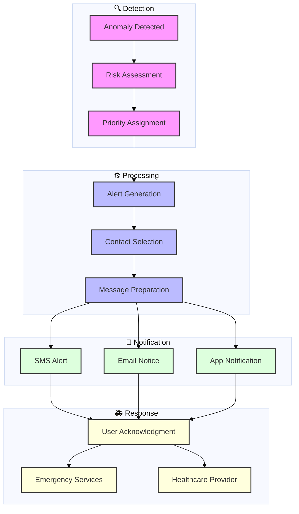

# AIMED Alert System Flow

## Alert Processing Pipeline

```mermaid
%%{init: {'theme': 'base', 'themeVariables': { 'fontSize': '16px', 'fontFamily': 'arial', 'lineWidth': '2px' }}}%%
graph TD
    subgraph Detection ["🔍 Detection"]
        A1[Anomaly Detected]
        A2[Risk Assessment]
        A3[Priority Assignment]
    end

    subgraph Processing ["⚙️ Processing"]
        B1[Alert Generation]
        B2[Contact Selection]
        B3[Message Preparation]
    end

    subgraph Notification ["📱 Notification"]
        C1[SMS Alert]
        C2[Email Notice]
        C3[App Notification]
    end

    subgraph Response ["🚑 Response"]
        D1[User Acknowledgment]
        D2[Emergency Services]
        D3[Healthcare Provider]
    end

    A1 --> A2
    A2 --> A3
    A3 --> B1
    B1 --> B2
    B2 --> B3
    B3 --> C1
    B3 --> C2
    B3 --> C3
    C1 --> D1
    C2 --> D1
    C3 --> D1
    D1 --> D2
    D1 --> D3

    classDef detectClass fill:#f9f,stroke:#333,stroke-width:2px;
    classDef processClass fill:#bbf,stroke:#333,stroke-width:2px;
    classDef notifyClass fill:#dfd,stroke:#333,stroke-width:2px;
    classDef responseClass fill:#ffd,stroke:#333,stroke-width:2px;

    class A1,A2,A3 detectClass;
    class B1,B2,B3 processClass;
    class C1,C2,C3 notifyClass;
    class D1,D2,D3 responseClass;
```
