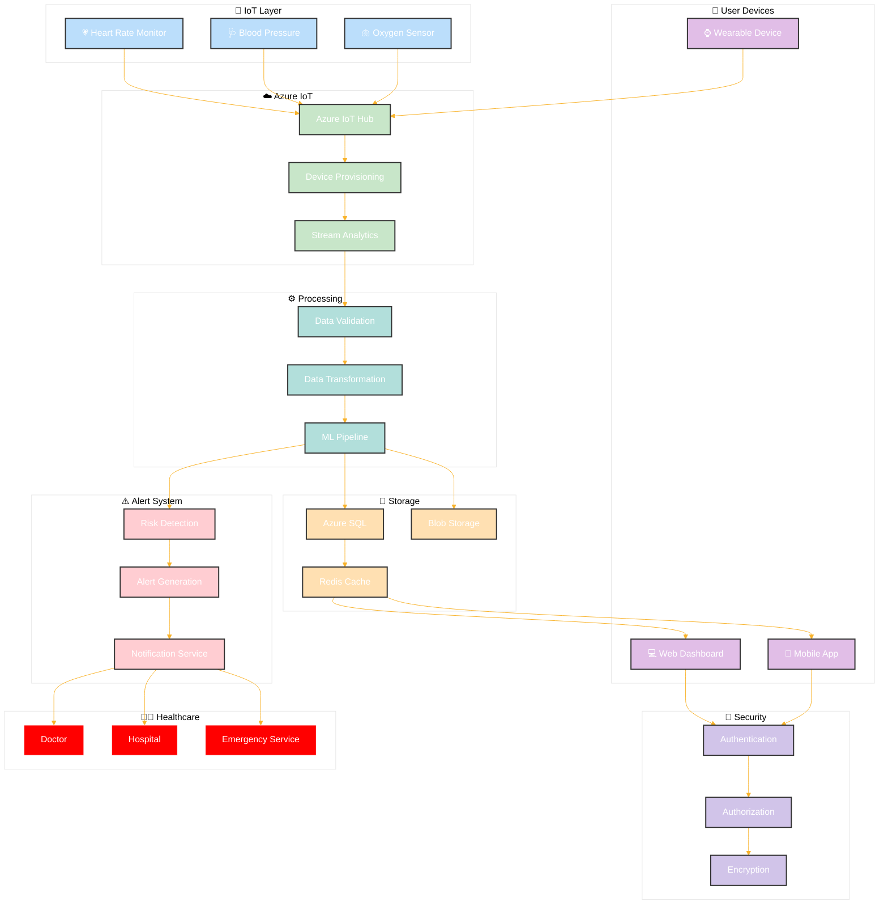

# AIMED Complete System Flow

## Diagram Components

### 1. User Devices 👥
- Mobile App
- Web Dashboard
- Wearable Device

### 2. IoT Layer 📡
- Heart Rate Monitor
- Blood Pressure Device
- Oxygen Sensor

### 3. Azure IoT ☁️
- IoT Hub
- Device Provisioning
- Stream Analytics

### 4. Processing ⚙️
- Data Validation
- Data Transformation
- ML Pipeline

### 5. Storage 💾
- Azure SQL
- Blob Storage
- Redis Cache

### 6. Security 🔐
- Authentication
- Authorization
- Encryption

### 7. Alert System ⚠️
- Risk Detection
- Alert Generation
- Notification Service

### 8. Healthcare 👨‍⚕️
- Doctor
- Hospital
- Emergency Service

## Flow Description

1. **Data Collection**
   - Wearable devices and IoT sensors collect health data
   - Data is sent to Azure IoT Hub

2. **Data Processing**
   - Stream Analytics processes real-time data
   - Data validation and transformation
   - ML Pipeline analyzes health patterns

3. **Storage & Caching**
   - Data stored in Azure SQL and Blob Storage
   - Redis Cache for quick access

4. **Security**
   - Multi-layer security implementation
   - Authentication and Authorization
   - Data encryption

5. **Alert Handling**
   - Continuous risk monitoring
   - Automated alert generation
   - Multi-channel notifications

6. **Healthcare Response**
   - Healthcare providers receive alerts
   - Emergency services coordination
   - Real-time patient monitoring
