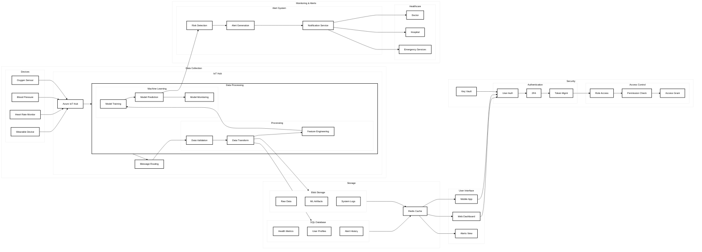

# AIMED Complete System Landscape

## System Components Description

### User Interface
- Web Dashboard
- Mobile App
- Alerts View

### Data Collection
- IoT Devices
  - Wearable Devices
  - Health Monitors
- Azure IoT Hub
  - Device Management
  - Message Routing

### Data Processing
- Data Pipeline
  - Validation
  - Transformation
  - Feature Engineering
- Machine Learning
  - Model Training
  - Predictions
  - Monitoring

### Storage
- SQL Database
  - Health Data
  - User Profiles
- Blob Storage
  - Raw Data
  - ML Models
- Redis Cache

### Security
- Authentication
  - User Auth
  - 2FA
  - Token Management
- Access Control
  - RBAC
  - Permissions
- Key Vault

### Monitoring & Alerts
- Alert System
  - Risk Detection
  - Notifications
- Healthcare Response
  - Doctors
  - Hospitals
  - Emergency Services
