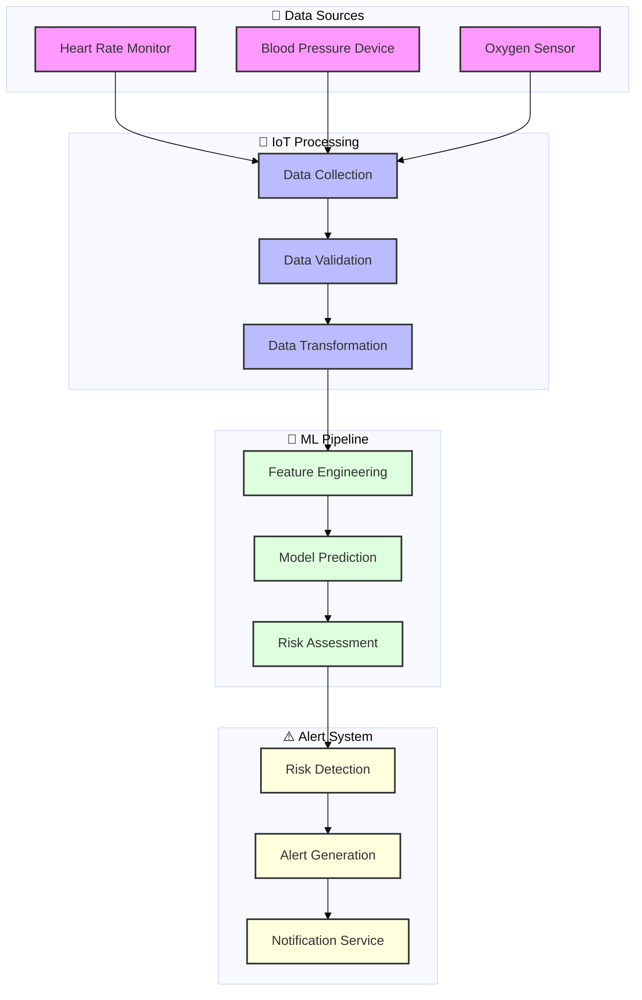

# AIMED Data Flow Diagrams

## Health Data Pipeline

```mermaid
%%{init: {'theme': 'base', 'themeVariables': { 'fontSize': '16px', 'fontFamily': 'arial', 'lineWidth': '2px' }}}%%
graph TD
    subgraph Data Sources ["🏥 Data Sources"]
        A1[Heart Rate Monitor]
        A2[Blood Pressure Device]
        A3[Oxygen Sensor]
    end

    subgraph IoT Processing ["📡 IoT Processing"]
        B1[Data Collection]
        B2[Data Validation]
        B3[Data Transformation]
    end

    subgraph ML Pipeline ["🤖 ML Pipeline"]
        C1[Feature Engineering]
        C2[Model Prediction]
        C3[Risk Assessment]
    end

    subgraph Alert System ["⚠️ Alert System"]
        D1[Risk Detection]
        D2[Alert Generation]
        D3[Notification Service]
    end

    A1 --> B1
    A2 --> B1
    A3 --> B1
    B1 --> B2
    B2 --> B3
    B3 --> C1
    C1 --> C2
    C2 --> C3
    C3 --> D1
    D1 --> D2
    D2 --> D3

    classDef sourceClass fill:#f9f,stroke:#333,stroke-width:2px;
    classDef processClass fill:#bbf,stroke:#333,stroke-width:2px;
    classDef mlClass fill:#dfd,stroke:#333,stroke-width:2px;
    classDef alertClass fill:#ffd,stroke:#333,stroke-width:2px;

    class A1,A2,A3 sourceClass;
    class B1,B2,B3 processClass;
    class C1,C2,C3 mlClass;
    class D1,D2,D3 alertClass;
```
