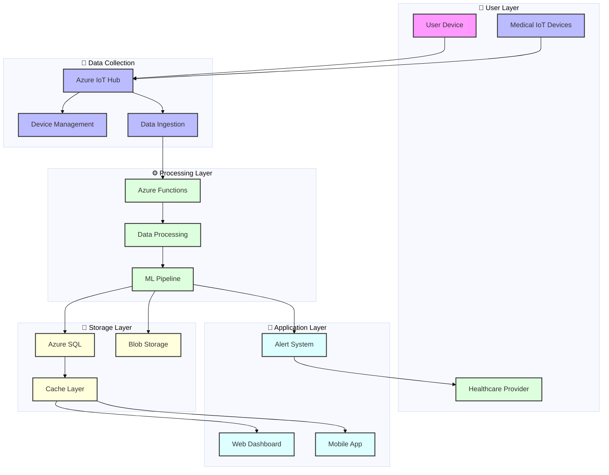

# AIMED System Architecture Diagrams

## Overall System Architecture

```mermaid
%%{init: {'theme': 'base', 'themeVariables': { 'fontSize': '16px', 'fontFamily': 'arial', 'lineWidth': '2px' }}}%%
graph TD
    style A fill:#f9f,stroke:#333,stroke-width:2px
    style B fill:#bbf,stroke:#333,stroke-width:2px
    style C fill:#dfd,stroke:#333,stroke-width:2px

    subgraph User Layer ["👥 User Layer"]
        A[User Device]
        B[Medical IoT Devices]
        C[Healthcare Provider]
    end

    subgraph Data Collection ["📡 Data Collection"]
        D[Azure IoT Hub]
        E[Device Management]
        F[Data Ingestion]
    end

    subgraph Processing Layer ["⚙️ Processing Layer"]
        G[Azure Functions]
        H[Data Processing]
        I[ML Pipeline]
    end

    subgraph Storage Layer ["💾 Storage Layer"]
        J[Azure SQL]
        K[Blob Storage]
        L[Cache Layer]
    end

    subgraph Application Layer ["📱 Application Layer"]
        M[Web Dashboard]
        N[Mobile App]
        O[Alert System]
    end

    A --> D
    B --> D
    D --> E
    D --> F
    F --> G
    G --> H
    H --> I
    I --> J
    I --> K
    J --> L
    L --> M
    L --> N
    I --> O
    O --> C

    classDef userLayer fill:#f9f,stroke:#333,stroke-width:2px;
    classDef dataLayer fill:#bbf,stroke:#333,stroke-width:2px;
    classDef processLayer fill:#dfd,stroke:#333,stroke-width:2px;
    classDef storageLayer fill:#ffd,stroke:#333,stroke-width:2px;
    classDef appLayer fill:#dff,stroke:#333,stroke-width:2px;

    class A,B,C userLayer;
    class D,E,F dataLayer;
    class G,H,I processLayer;
    class J,K,L storageLayer;
    class M,N,O appLayer;
```
