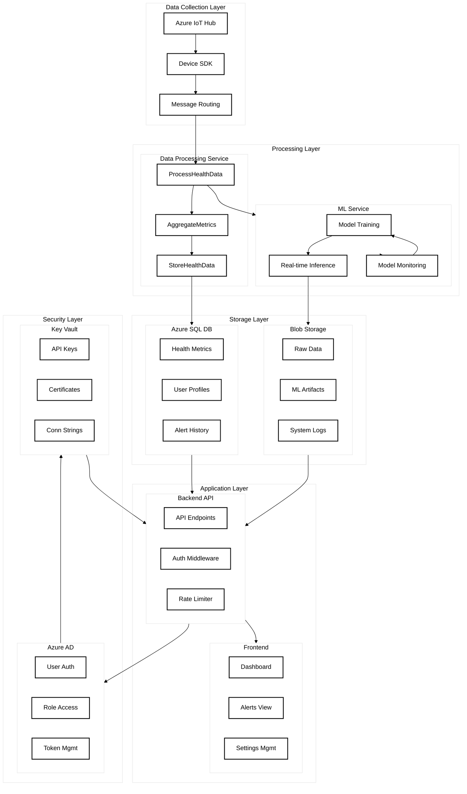
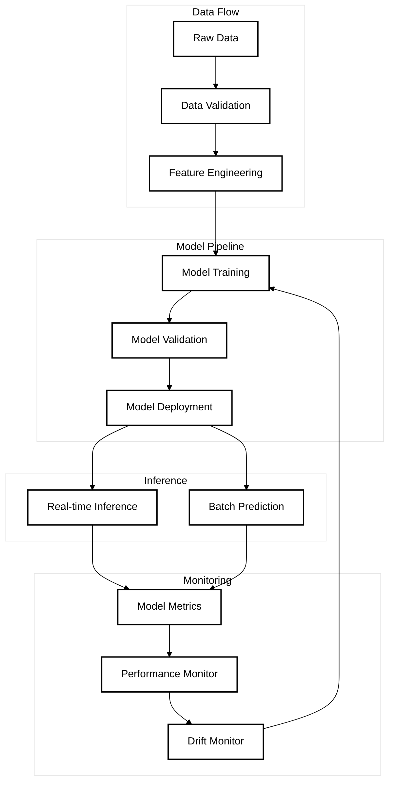

# AIMED System Components Diagram

## System Architecture


## ML Pipeline Flow


## Authentication Flow
```mermaid
%%{init: {
  'theme': 'base',
  'themeVariables': {
    'primaryTextColor': '#000',
    'primaryColor': '#fff',
    'primaryBorderColor': '#000',
    'lineColor': '#000',
    'fontSize': '16px'
  }
}}%%
flowchart TD
    %% Style definitions
    classDef userClass fill:#fff,stroke:#000,stroke-width:2px,color:#000
    classDef authClass fill:#fff,stroke:#000,stroke-width:2px,color:#000
    classDef tokenClass fill:#fff,stroke:#000,stroke-width:2px,color:#000
    classDef accessClass fill:#fff,stroke:#000,stroke-width:2px,color:#000

    %% User Flow
    subgraph UF[User Flow]
        LR[Login Request]
        CR[Credentials]
    end

    %% Authentication
    subgraph AUTH[Authentication]
        VA[Validate Auth]
        MFA[2FA Check]
    end

    %% Token Management
    subgraph TM[Token Management]
        GT[Generate Token]
        VT[Validate Token]
        RT[Refresh Token]
    end

    %% Access Control
    subgraph AC[Access Control]
        RC[Role Check]
        PC[Permission Check]
        AG[Access Grant]
    end

    %% Connections
    LR --> CR
    CR --> VA
    VA --> MFA
    MFA --> GT
    GT --> VT
    VT --> RT
    RT --> RC
    RC --> PC
    PC --> AG

    %% Apply styles
    class LR,CR userClass
    class VA,MFA authClass
    class GT,VT,RT tokenClass
    class RC,PC,AG accessClass
