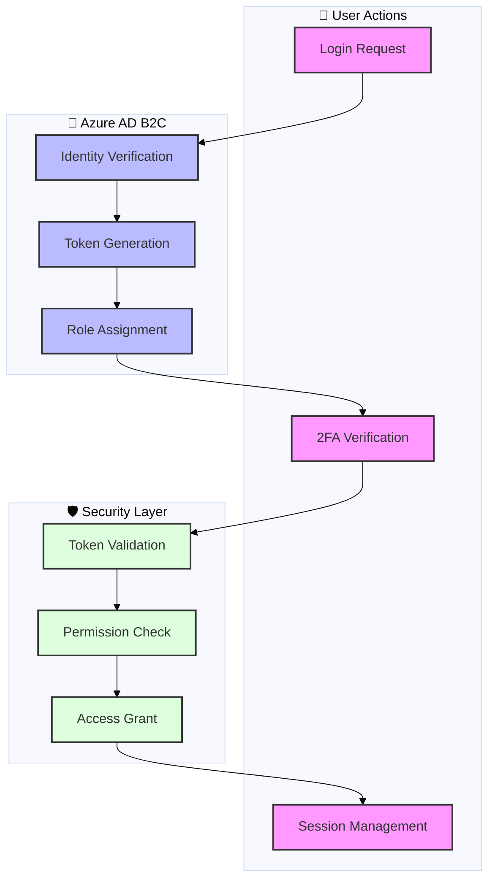

# AIMED User Authentication Flow

## Authentication Process

```mermaid
%%{init: {'theme': 'base', 'themeVariables': { 'fontSize': '16px', 'fontFamily': 'arial', 'lineWidth': '2px' }}}%%
graph TD
    subgraph User Actions ["👤 User Actions"]
        A1[Login Request]
        A2[2FA Verification]
        A3[Session Management]
    end

    subgraph Azure AD B2C ["🔐 Azure AD B2C"]
        B1[Identity Verification]
        B2[Token Generation]
        B3[Role Assignment]
    end

    subgraph Security Layer ["🛡️ Security Layer"]
        C1[Token Validation]
        C2[Permission Check]
        C3[Access Grant]
    end

    A1 --> B1
    B1 --> B2
    B2 --> B3
    B3 --> A2
    A2 --> C1
    C1 --> C2
    C2 --> C3
    C3 --> A3

    classDef userClass fill:#f9f,stroke:#333,stroke-width:2px;
    classDef azureClass fill:#bbf,stroke:#333,stroke-width:2px;
    classDef securityClass fill:#dfd,stroke:#333,stroke-width:2px;

    class A1,A2,A3 userClass;
    class B1,B2,B3 azureClass;
    class C1,C2,C3 securityClass;
```
